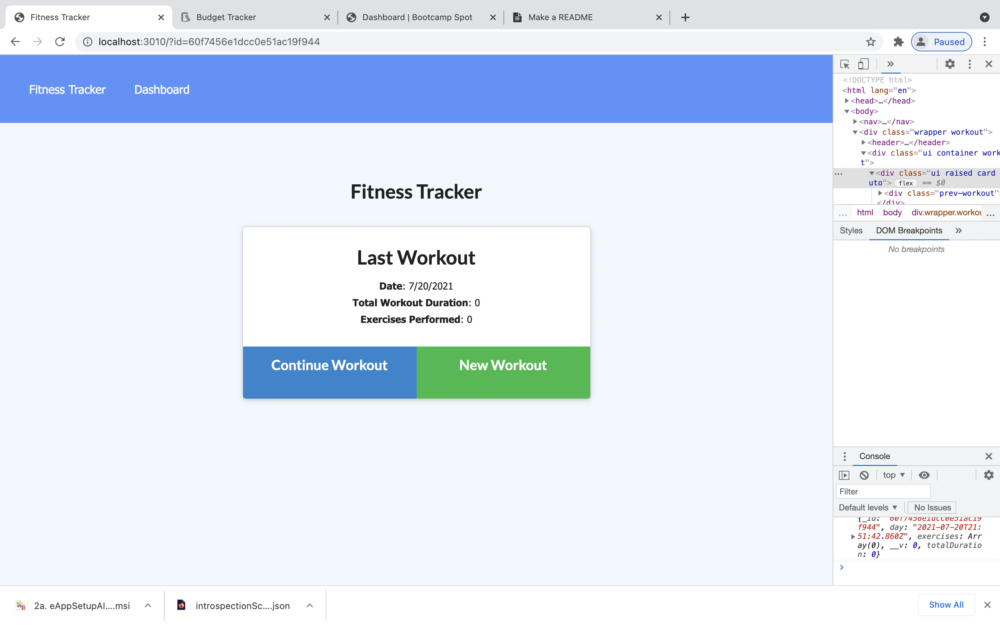
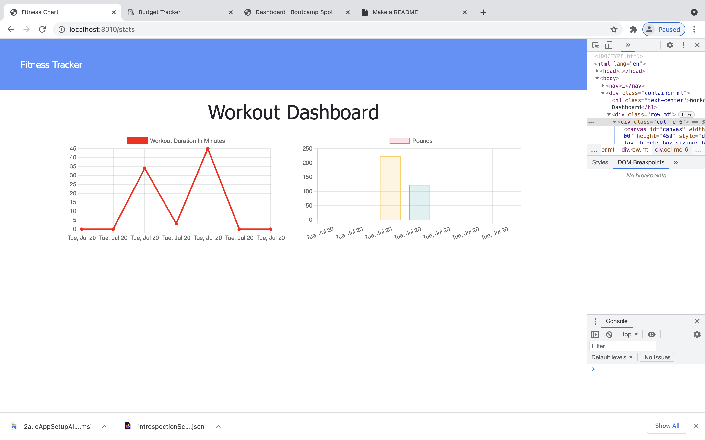
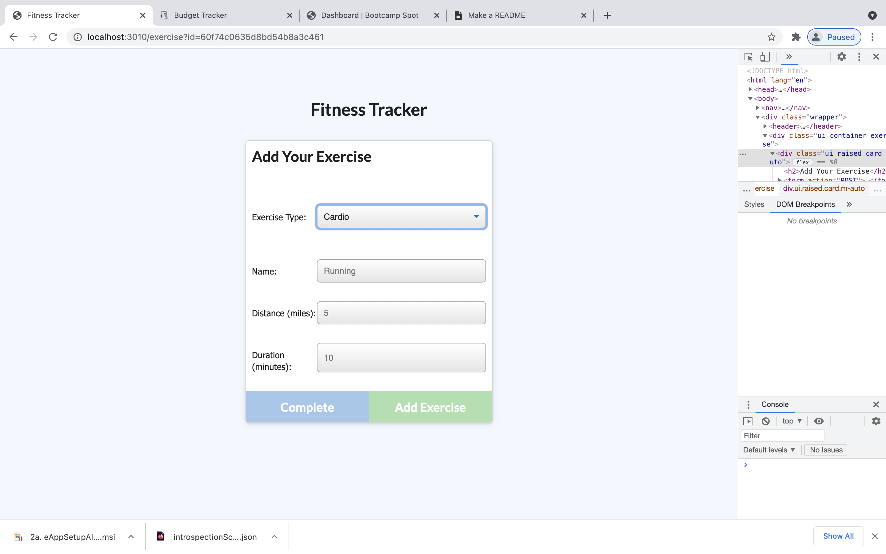
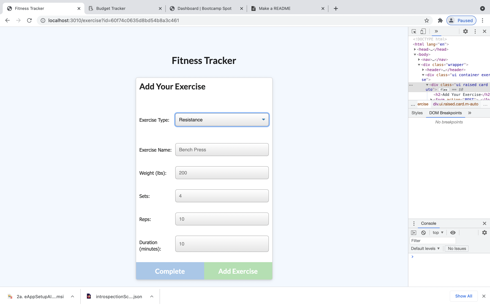

# fitness-tracker
tracks fitness level and energy used.
Also displays them in a graph

## Installation
Not much used to intall just use "NPM START"
and open in the correct localhost 
or you can open [here](https://fitnesstk.herokuapp.com/)

## Usage

You can track your works how long the are, how many reps are taken.
The distance you run and many more

## Contributing
Pull requests are welcome, Phillip Stewat as made most of the changes required for app to function.
 
## Show App

showing app working on local host 

## License
[MIT](https://choosealicense.com/licenses/mit/)
